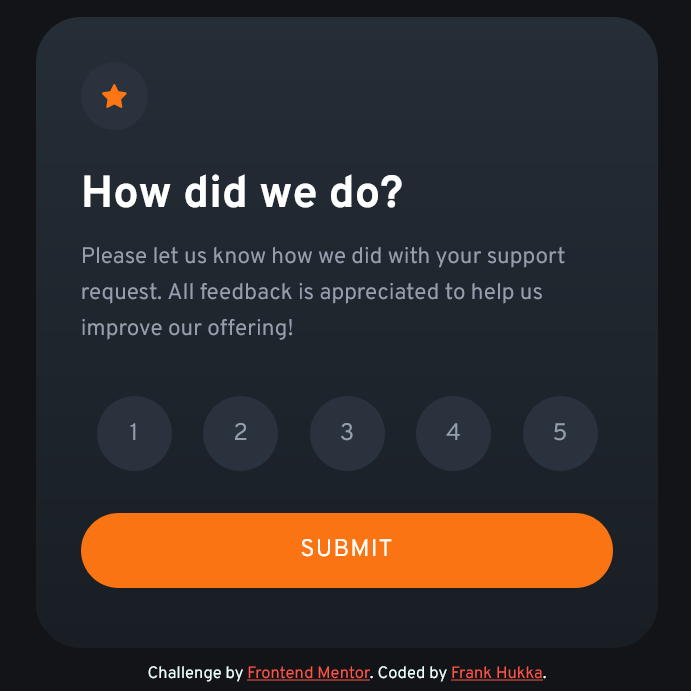
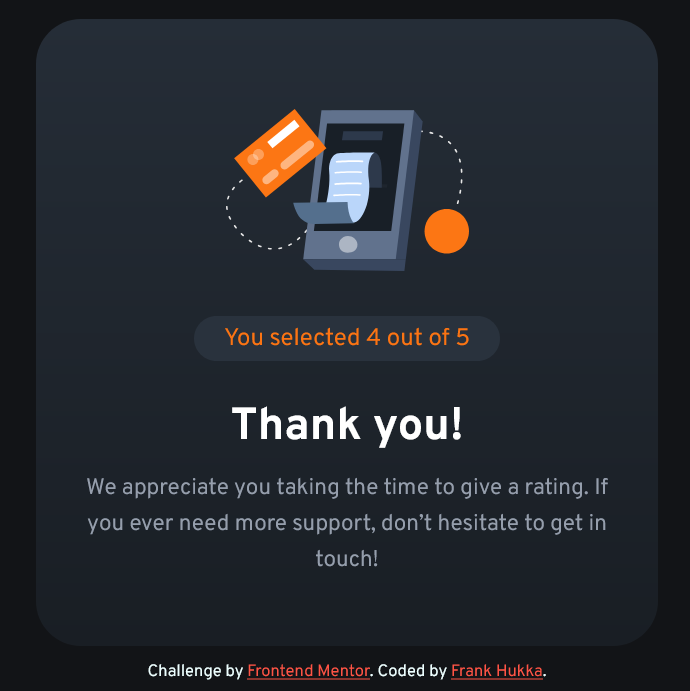

# Frontend Mentor - Interactive rating component solution

This is a solution to the [Interactive rating component challenge on Frontend Mentor](https://www.frontendmentor.io/challenges/interactive-rating-component-koxpeBUmI). Frontend Mentor challenges help you improve your coding skills by building realistic projects. 

## Table of contents

- [Overview](#overview)
  - [The challenge](#the-challenge)
  - [Screenshot](#screenshot)
  - [Links](#links)
- [My process](#my-process)
  - [Built with](#built-with)
  - [What I learned](#what-i-learned)
  - [Continued development](#continued-development)
  - [Useful resources](#useful-resources)
- [Author](#author)

## Overview

### The challenge

Users should be able to:

- View the optimal layout for the app depending on their device's screen size
- See hover states for all interactive elements on the page
- Select and submit a number rating
- See the "Thank you" card state after submitting a rating

### Screenshot

### Links

- Solution URL: Coming soon
- [Live Site](https://frankhukka.github.io/intracomp/)

## My process

### Built with

- HTML5 markup
- CSS custom properties
- Flexbox

### What I learned

In this project I learned to manipulate the DOM with JavaScript. I learned to register event handlers to listen to click events in the page.

The most challenging part for me was to get the thank you state to show up, while the rating state disappeared. I finally figured it out by utilizing the `Element.classList` property, specifically `Element.classList.remove` and `Element.classList.add` methods to remove and add the "hidden" property, respectively. After that, the most difficult thing was to just style the cards properly.

### Continued development

In future projects I want to try more complex JavaScript programming. I also want to learn about various JS libraries such as React.

### Useful resources

- [MDN Web Docs](https://developer.mozilla.org/en-US/) - Useful guides and references about HTML, CSS, Web APIs etc.

## Author

- GitHub - [Frank Hukka](https://github.com/FrankHukka)
- Frontend Mentor - [@FrankHukka](https://www.frontendmentor.io/profile/FrankHukka)
